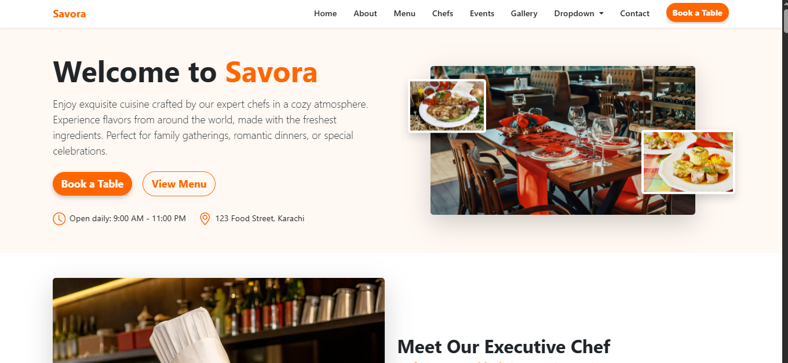

# 🍽️ Savora - Restaurant Website



Savora is a modern, fully responsive restaurant website built with **HTML**, **CSS**, **Bootstrap 5**, and **JavaScript**.  
It features smooth scrolling, AOS animations, interactive gallery filtering, reservation forms, and more — designed for an elegant dining experience.

---

## 📋 Features

- **Responsive Design** – Fully mobile-friendly using Bootstrap 5
- **Animated On Scroll** – Smooth AOS animations across sections
- **Interactive Gallery** – Filter images by category with hover overlays
- **Reservation Form** – Simple booking form with validation
- **Event Inquiry** – Dedicated form for event planning requests
- **Custom Color Theme** – Warm orange (`#ff6600`) accents
- **Smooth Navigation** – JavaScript scroll effects for menu links

---

## 🖼 Sections Overview

1. **Hero Section** – Welcome message, featured dishes, opening hours, and location  
2. **About / Chef Section** – Meet the head chef with awards and images  
3. **Menu Section** – Starters, main courses, desserts, beverages with pricing  
4. **Testimonials** – Customer feedback cards  
5. **Chefs Showcase** – Executive chef details + team members  
6. **Reservation Section** – Table booking form & restaurant info  
7. **Events Section** – Private dining & packages  
8. **Gallery** – Filterable image grid with hover effects  
9. **Contact Section** – Address, phone, email, and contact form  
10. **Footer** – Quick links and social media icons

---

## 🛠 Technologies Used

- **HTML5**  
- **CSS3 / Bootstrap 5**  
- **JavaScript (ES6)**  
- **AOS.js** (Animate on Scroll)  
- **Bootstrap Icons**

---

## 🚀 Getting Started

1. Clone the repository:
   ```bash
   git clone https://github.com/zara-shahid/Savora-Restauranta.git
Navigate to the project folder:

cd savora
Open index.html in your browser.

📷 Preview

📜 License
This project is licensed under the MIT License – feel free to use and modify it.

🙌 Acknowledgments

Bootstrap 5 for responsive design

AOS.js for animations

Bootstrap Icons for icons
